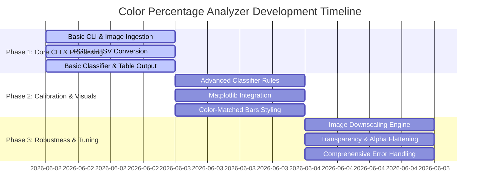
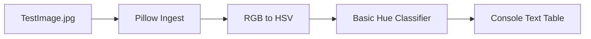
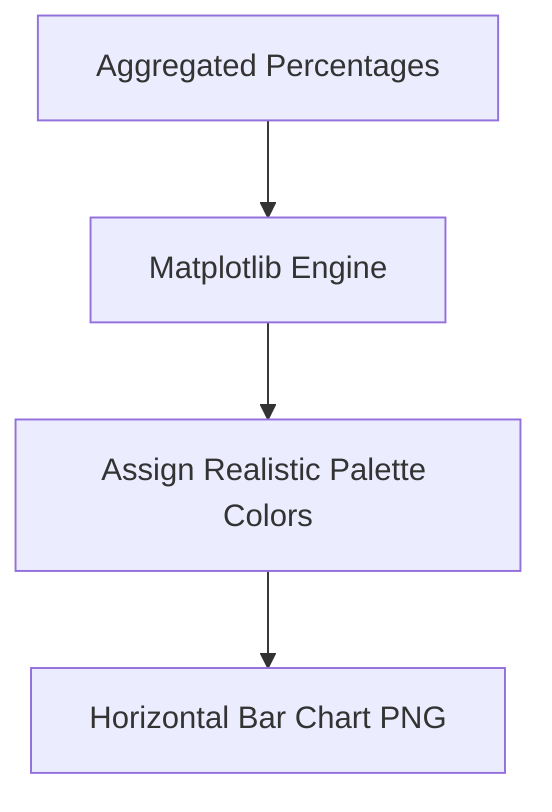
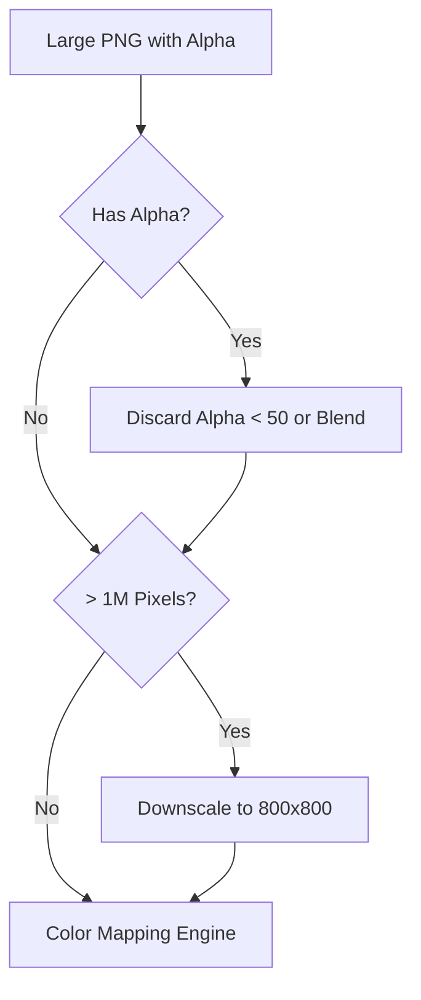

# Phase-Wise System Architecture: Image Color Analyzer Tool

This document outlines the evolutionary architecture of the **Image Color Analyzer Tool**, broken down into incremental, testable phases. This ensures that a working prototype is delivered early, followed by iterative enhancements for accuracy, visualization, and performance.

---

## Evolution Timeline Overview

---

## Phase 1: Minimum Viable Product (MVP) - Core Logic & CLI

### Goal
Establish the end-to-end data pipeline: load an image, inspect pixel values, run a simple color classification engine, and output the percentage breakdown as a text-based terminal table.

### Component Design (Phase 1)
1. **CLI Entry Point (`color_analyzer.py`)**: Receives the image file path as a positional argument.
2. **`ImageLoader` (Barebones)**: Opens the image using Pillow (`PIL.Image`) and extracts a list of raw RGB tuples.
3. **`ColorSpaceConverter`**: Normalizes RGB values from $[0, 255]$ to $[0, 1]$ and converts them to HSV space.
4. **`BasicClassifier`**: Implements a simple hue-based classifier using coarse thresholds.
5. **`TextReporter`**: Groups values and prints a formatted markdown table in the terminal.

### Basic Color Rules (Phase 1)
* **White**: $S < 0.10$ and $V > 0.90$
* **Black**: $V < 0.15$
* **Gray**: $S < 0.15$ and $0.15 \le V \le 0.90$
* **Chromatic Hues**:
  * Red: $H < 20$ or $H \ge 340$
  * Orange: $20 \le H < 45$
  * Yellow: $45 \le H < 75$
  * Green: $75 \le H < 160$
  * Blue: $160 \le H < 260$
  * Purple: $260 \le H < 300$
  * Pink: $300 \le H < 340$

---

## Phase 2: Advanced Calibration & Visualization

### Goal
Refine the color mapping boundaries to handle complex shades (e.g., skin tones, burgundy, brown, dark green) and output a high-fidelity visual horizontal bar chart using Matplotlib.

### Component Design (Phase 2)
1. **`AdvancedClassifier`**:
   * Introduces nested rules to distinguish **Brown** from Orange/Yellow/Pink based on saturation ($S$) and brightness ($V$) values.
   * Introduces **Brown** as the 11th category.
2. **`ChartGenerator`**:
   * Generates a horizontal bar chart utilizing `matplotlib.pyplot`.
   * Colors the bars using exact hex values corresponding to the color names (e.g., the "Pink" category is colored `#FFC0CB`).
   * Saves the chart as an image (`output_chart.png`).

### Refined Classification Matrix (Phase 2)
| Category | Hue ($H$) Range | Saturation ($S$) | Value ($V$) |
|---|---|---|---|
| **White** | Any | $< 0.08$ | $\ge 0.85$ |
| **Black** | Any | Any | $< 0.15$ |
| **Gray** | Any | $< 0.15$ | $0.15 \le V < 0.85$ |
| **Red** | $[0, 15) \cup [345, 360]$ | $\ge 0.15$ | $\ge 0.50$ |
| **Orange** | $[15, 35)$ | $\ge 0.15$ | $\ge 0.55$ |
| **Yellow** | $[35, 65)$ | $\ge 0.30$ | $\ge 0.50$ |
| **Green** | $[65, 165)$ | $\ge 0.15$ | $\ge 0.15$ |
| **Blue** | $[165, 265)$ | $\ge 0.15$ | $\ge 0.15$ |
| **Purple** | $[265, 290)$ | $\ge 0.15$ | $\ge 0.15$ |
| **Pink** | $[290, 345)$ | $\ge 0.20$ | $\ge 0.50$ |
| **Brown** | See Sub-rules Below | - | - |

#### Brown Specific Logic
If Hue falls in the following ranges but fails brightness/saturation thresholds, it is mapped to **Brown**:
* If $H \in [15, 35)$ (Orange) and $V < 0.55$
* If $H \in [35, 65)$ (Yellow) and $V < 0.50$
* If $H \in [35, 65)$ (Yellow) and $S < 0.30$
* If $H \in [290, 345)$ (Pink/Magenta) and $V < 0.50$

---

## Phase 3: Production Readiness & Optimization

### Goal
Implement performance optimizations for large images, handle transparency layer edge cases, and add extensive error checking.

### Component Design (Phase 3)
1. **`ScaleOptimizer`**:
   * Checks dimensions of incoming images.
   * If total pixels exceed $1,000,000$, downsamples the image to $800 \times 800$ resolution using `PIL.Image.Resampling.LANCZOS`. This preserves color ratios while reducing time complexity from minutes to sub-second.
2. **`TransparencyHandler`**:
   * Discards pixels with Alpha $< 50$.
   * Blends semi-transparent pixels onto a flat background (White or Black, customizable via command line).
3. **`RobustRunner`**:
   * Gracefully catches I/O errors, corruption, and invalid path inputs.
   * Outputs progress updates during classification (e.g., using `tqdm` or progress milestones).

---

## Phase 4: Scaling & User Interfaces (Future Work)

### Goal
Move from a local script to a distributable utility, interactive dashboard, or web service.

### Components
1. **Streamlit/React Dashboard**: Build a browser-based drag-and-drop web page for users to upload images and inspect the breakdown interactively.
2. **Batch Processor CLI**: Add directory processing, saving outputs to JSON databases for downstream machine learning datasets.
3. **LLM Explainer Integration (Groq)**: Integrate Groq API (utilizing the environment variable `GROQ_API_KEY` or placeholder `<GROQ_API_KEY>`) to automatically generate artistic commentary (e.g., explaining the mood, historical context, or composition style) based on the computed color percentage breakdown. This replaces any planned OpenAI-based analysis.
